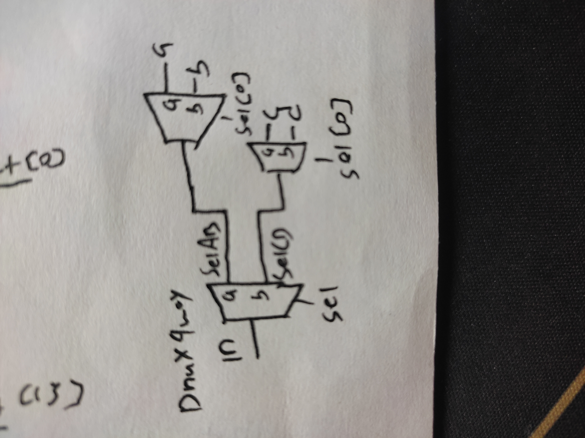
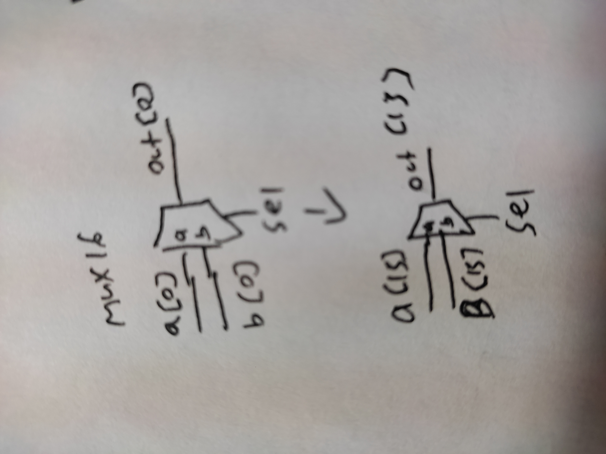
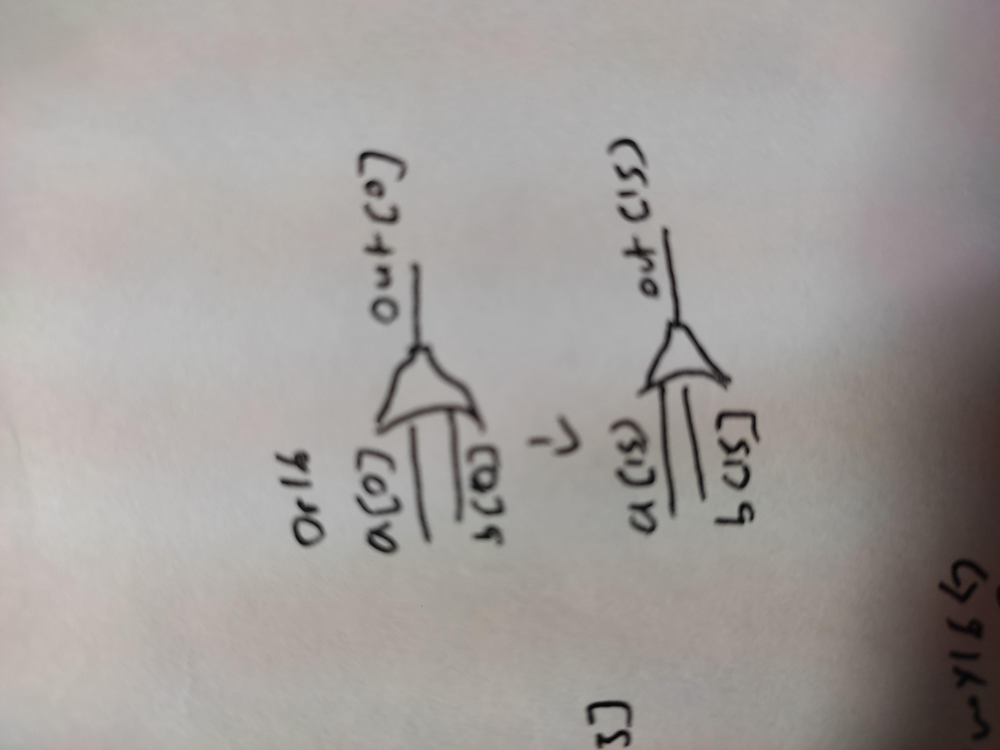
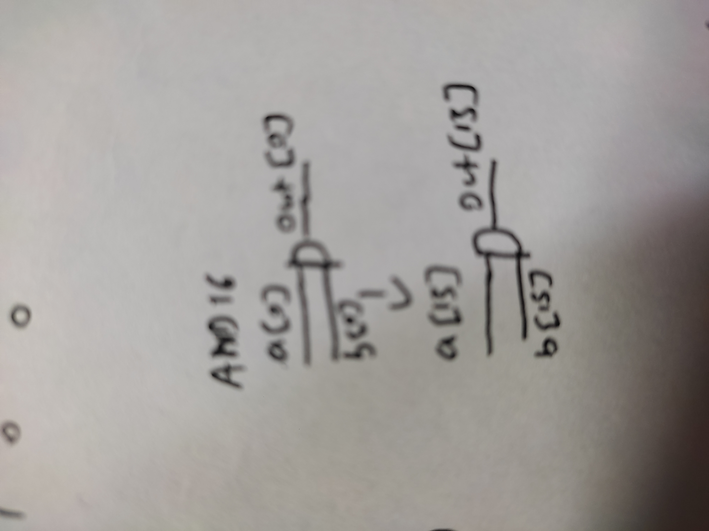
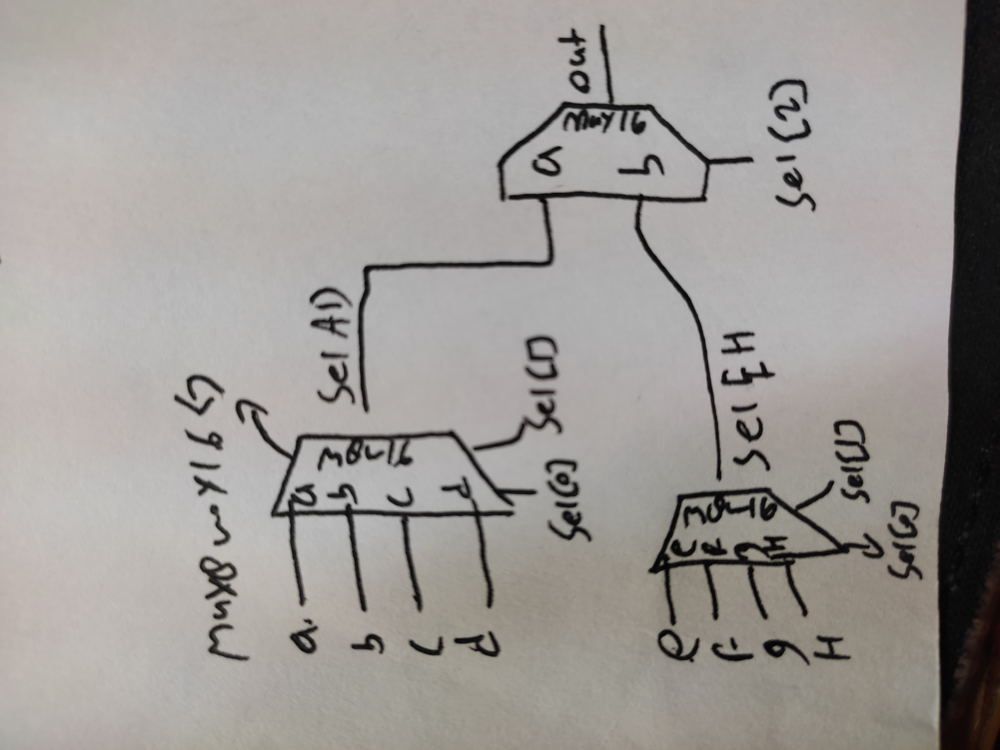

```
Project 1
A typical computer architecture is based on a set of elementary logic gates like And, Or, Mux, etc.,
as well as their bitwise versions And16, Or16, Mux16, etc. (assuming a 16-bit machine). In this
project you will build a typical set of basic logic gates. These gates form the elementary building
blocks from which you will build the computer’s CPU and RAM chips in later projects.
Below we describe the tools, resources, and implementation tips needed for completing project 1.

Objective
Build the following logic gates:
Nand (given)
Not
And
Or
Xor
Mux
DMux
Not16
And16
Or16
Mux16
Or8Way
Mux4Way16
Mux8Way16
DMux4Way
DMux8Way
```
---










refer:
1. Chapter 1 Nand2tetris

https://www.techtarget.com/whatis/definition/logic-gate-AND-OR-XOR-NOT-NAND-NOR-and-XNOR

2. 計算機結構 第三週 -- Ａdder

https://www.youtube.com/live/0XUUWyPu1wo?si=Pl2IsmeN-F_ufMnP

