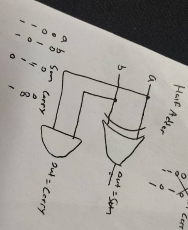

```
Project 2
The centerpiece of the computer's architecture is the CPU, or Central Processing Unit, and the
computational centerpiece of the CPU is the ALU, or Arithmetic-Logic Unit. In this project you will
gradually build a set of chips that carry out arithmetic addition, culminating in the construction of
an ALU: the ALU chip of the Hack computer. All the chips built in this project are standard, except
for the ALU, which varies from one computer architecture to another.

Objective
Build the following chips:
HalfAdder
FullAdder
Add16
Inc16
ALU
The only building blocks that you can use are some of the chips listed in Project 1, and the chips
that you will gradually build on top of them in this project.
```


----

#Half,FullAdder, Inc16, Add16




got help by chatgpt for understand

-----

#ALU

refer:

1. 計算機結構 第五週 -- ALU
chapter 2 
https://drive.google.com/file/d/1ie9s3GjM2TrvL7PrEZJ00gEwezgNLOBm/view

2. 計算機結構 第七週 -- PC + 組合語言
https://www.youtube.com/live/-92943aDqok?si=UcU8d1ESR76ZfCEP

3. 計算機結構 第六週 -- Flip-Flop ，暫存器，記憶
https://www.youtube.com/watch?v=Ohb9GvlFAbE

4. got help by chatgpt for understand
