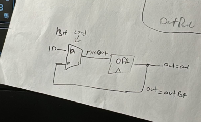
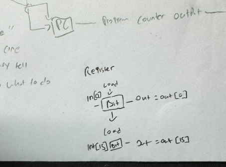
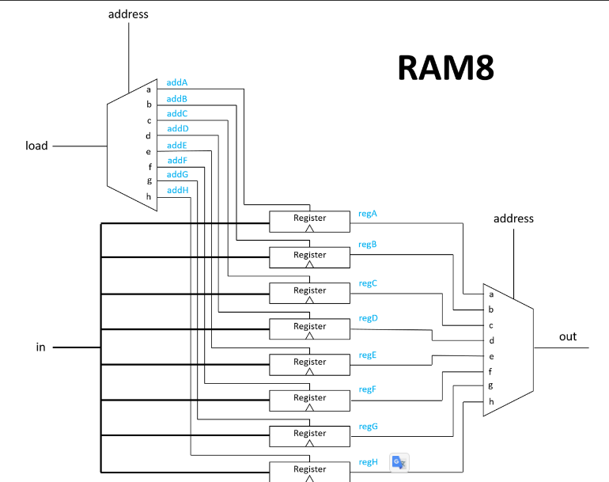
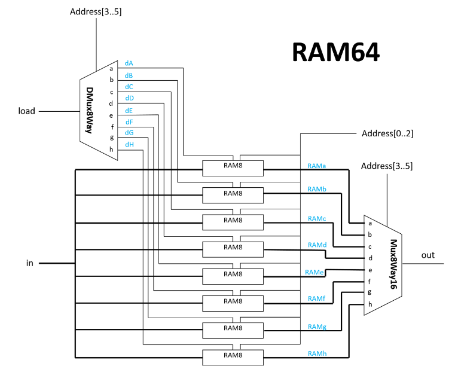
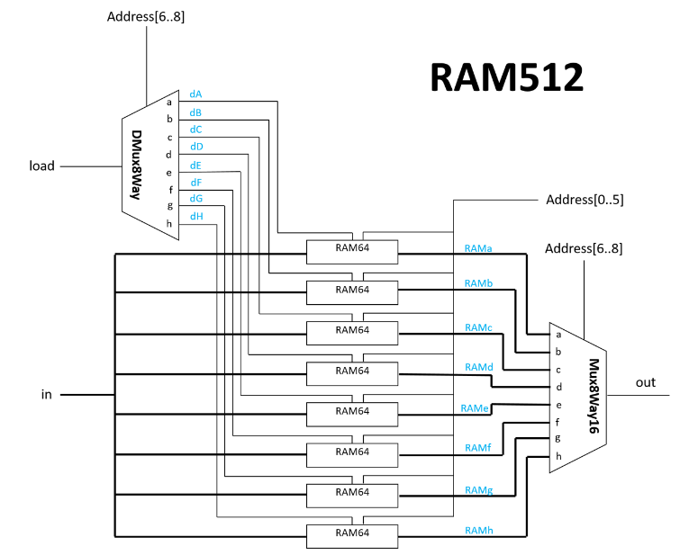
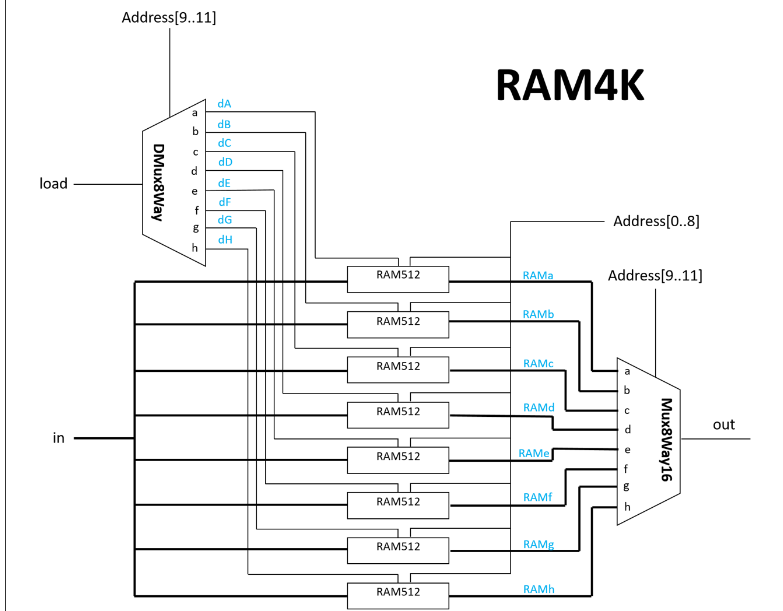
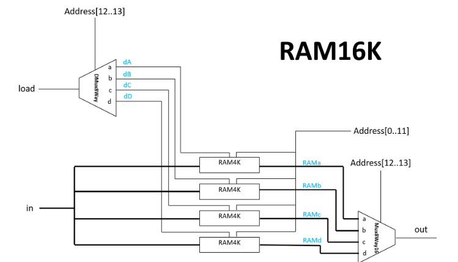
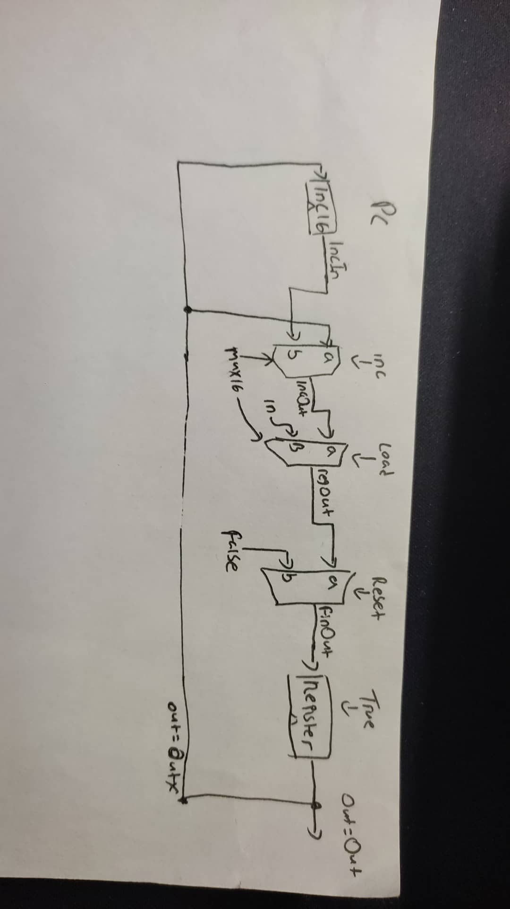

``````
Project 3
The computer's main memory, also called Random Access Memory, or RAM, is an addressable
sequence of registers, each designed to hold an n-bit value. In this project you will gradually build a
RAM unit. This involves two main issues: (i) using gate logic to store bits persistently, over time,
and (ii) using gate logic to locate ("address") the memory register on which we wish to operate.
Objective
Build the following chips:
DFF (given)
Bit
Register
RAM8
RAM64
RAM512
RAM4K
RAM16K
PC

``````
------------------------

#bit



If the load is 1, the input will be processed in DFF, and the subsequent output will be equal to the input. Otherwise, the output value will remain unchanged.

#register



register constructed with 16-bit chips

refer https://www.youtube.com/watch?v=5uSDC4Y_mVg

Nand2Tetris Project 03 Sequential Logic: flip flop, register, RAM and program counter.

#### got help by chatgpt to understand
-------------------

#Ram notes:RAM8, RAM64, RAM512, RAM4K, RAM16K

To combine an 8-bit RAM into a 32-bit RAM, we need to double the number of bits in each RAM cell and arrange them into 32 bits. This means we will have 32 RAM cells, each storing 1 bit.







---

#PC



Reference:

1. ChatGPT

2. Nand2Tetris Project 03 Sequential Logic: flip flop, register, RAM and program counter.

https://www.youtube.com/watch?v=5uSDC4Y_mVg

