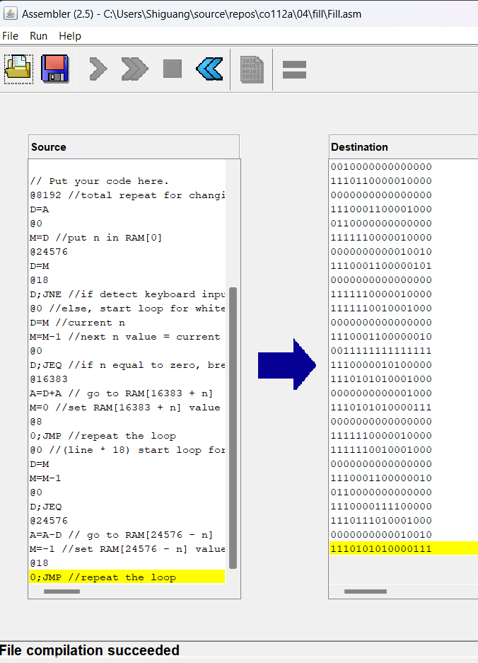
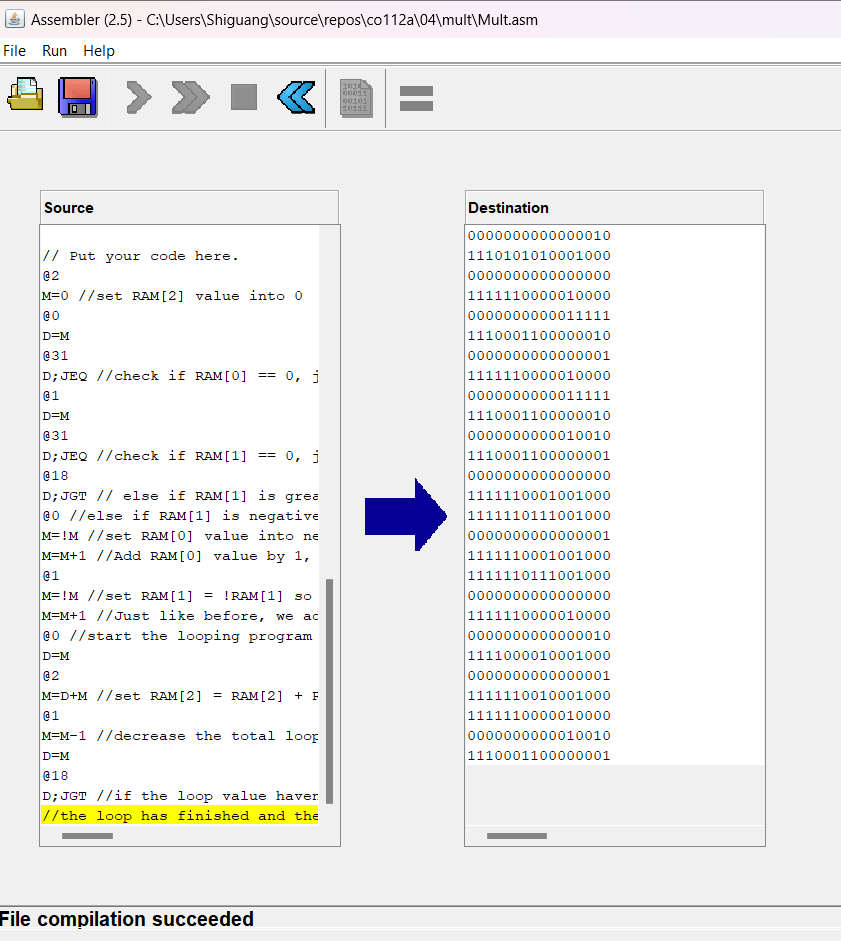
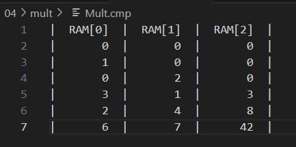

``````
Project 4

In this project you will write and execute some low-level machine language programs. In
particular, you will write programs in the Hack assembly language, use an assembler to translate
them into binary code, and test the resulting code. Since the Hack computer will be built only in
the next project, in this project you will run the programs on a CPU Emulator, designed to execute
binary code written in the Hack instruction set.

Tasks
Write and test two programs: Mult & Fill.asm
``````
-------------------
#fill.asm notes:
```
Runs an infinite loop that listens to the keyboard input.
When a key is pressed (any key), the program blackens the screen,
i.e. writes "black" in every pixel;
the screen should remain fully black as long as the key is pressed. 
When no key is pressed, the program clears the screen, i.e. writes
"white" in every pixel;
the screen should remain fully clear as long as no key is pressed.

In this program, the black screen loop will change the screen start from the top of the screen
while white screen loop will start from the bottom of the screen.

```

Translating asm program into hack

----------------------------------

#mult.asm notes:
``````
Multiplies R0 and R1 and stores the result in R2.

(R0, R1, R2 refer to RAM[0], RAM[1], and RAM[2], respectively.)

Program Function  --  R0 * R1 = R2. 
To multiplies R0 and R1, this program would do a loop for R1 times.

During the loop, R2 would be added by R0.
For example if R0 = 5 and R1 = 3 then we just need to add 5 to R2 for 3 times.

(in this program the first value of R2 would always be 0)
After the loop has finished, we got the final result R2.

E.x.
RAM[0] = 3
RAM[1] = 2
RAM[2] = 0 (still empty)

1. Add RAM[2] by RAM[0]
RAM[0] = 3
RAM[1] = 2
RAM[2] = 3

2. Decrease the value from RAM[1] by one 
RAM[0] = 3
RAM[1] = 1
RAM[2] = 3

3. Add RAM[2] by RAM[0]
RAM[0] = 3
RAM[1] = 1
RAM[2] = 6

4. Decrease the RAM[1] value by one
RAM[0] = 3
RAM[1] = 0
RAM[2] = 6

5. Since the value of RAM[1] equal to zero, so the loop is over.
The program would store value in RAM[0] into RAM[2] as a final result.
RAM[0] = 3
RAM[1] = 0
RAM[2] = 6

``````


Translating asm program into hack



output 

refer from CPU emulator demo
https://www.youtube.com/watch?v=8XieZhHNFVY&list=PLYM3zllSC3SVdjWQUfedxssewHRS7EHuA&index=9

