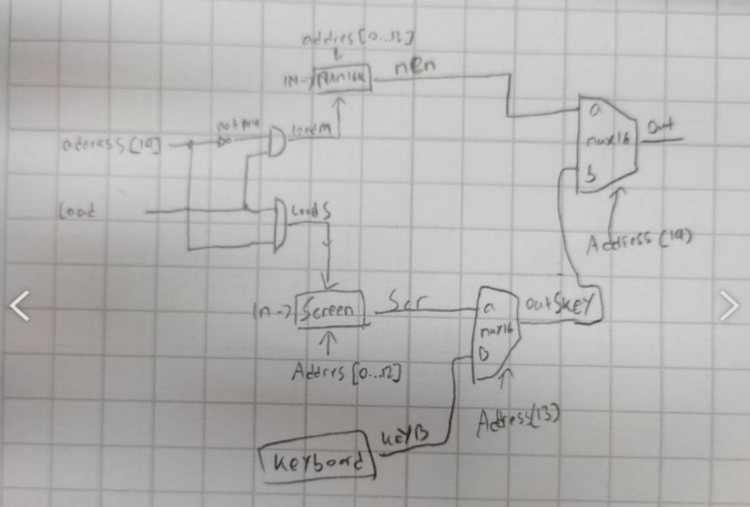

Project 5
In this project you will integrate the ALU and RAM devices built in projects 2 and 3 into a computer
system capable of executing programs written in the machine language introduced in project 4.

Objective, Build the following chips:
Memory, CPU, Computer    

Note: 
Memory notes:



loadM = load for memory
loadS = load for screen

CPU notes:

refer from nand2tetris chapter 6,
C-Instruction

https://b1391bd6-da3d-477d-8c01-38cdf774495a.filesusr.com/ugd/56440f_65a2d8eef0ed4e0ea2471030206269b5.pdf 


refer from nand2tetris chapter 5 https://drive.google.com/file/d/1nEptWuRpFF9zmqlKYq6s1UfDB_dd16vx/view 

CPU abstraction, implementation
```instruction[15] : to differ whether an instruction is an Address or a C-Instruction
instruction[12] : a
instruction[11] : c1
instruction[10] : c2
instruction[9]  : c3
instruction[8]  : c4
instruction[7]  : c5
instruction[6]  : c6
instruction[5]  : d1
instruction[4]  : d2
instruction[3]  : d3
instruction[2]  : j1
instruction[1]  : j2
instruction[0]  : j3
``````
Computer notes:


refer from nand2tetris chapter 5, Computer Architecture, Testing Computer
https://drive.google.com/file/d/1nEptWuRpFF9zmqlKYq6s1UfDB_dd16vx/view